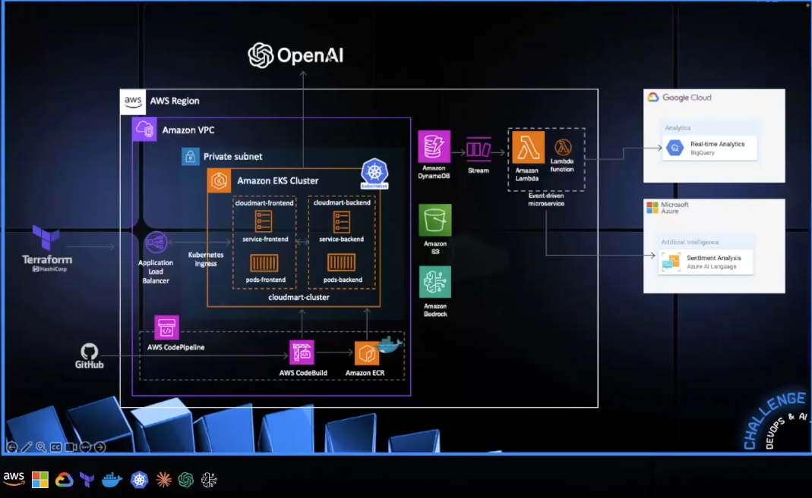

<p align="center">
  
  
## ☁️ MultiCloud, DevOps & AI Challenge — Day 5 —  ☁️

This is part of the final project of the Multicloud, Devops and AI Challenge!

In this project, I 


<h2>Environments and Technologies Used</h2>

  - Google Cloud
  - Microsoft Azure
  - Terraform 
  - 
  
  
<h2>Key Features</h2>  

✅ 
✅ 
✅ 

<h2>Step by Step Instructions</h2>

***1. Create a BigQuery with Google Cloud***

In this step, we will be setting up BigQuery with Google Cloud to create a data table and a query.

We will begin by 


***2.  Creating Resources using Terraform***

Before creating the resources with Terraform make sure it's set up and/or installed in your machine of choice.

We will use this main.tf for deployment 

```
provider "aws" {
  region = "us-east-1" 
}

# Tables DynamoDB
resource "aws_dynamodb_table" "cloudmart_products" {
  name           = "cloudmart-products"
  billing_mode   = "PAY_PER_REQUEST"
  hash_key       = "id"

  attribute {
    name = "id"
    type = "S"
  }
}

resource "aws_dynamodb_table" "cloudmart_orders" {
  name           = "cloudmart-orders"
  billing_mode   = "PAY_PER_REQUEST"
  hash_key       = "id"

  attribute {
    name = "id"
    type = "S"
  }
  
  stream_enabled   = true
  stream_view_type = "NEW_AND_OLD_IMAGES"
}

resource "aws_dynamodb_table" "cloudmart_tickets" {
  name           = "cloudmart-tickets"
  billing_mode   = "PAY_PER_REQUEST"
  hash_key       = "id"

  attribute {
    name = "id"
    type = "S"
  }
}

# IAM Role for Lambda function
resource "aws_iam_role" "lambda_role" {
  name = "cloudmart_lambda_role"

  assume_role_policy = jsonencode({
    Version = "2012-10-17"
    Statement = [
      {
        Action = "sts:AssumeRole"
        Effect = "Allow"
        Principal = {
          Service = "lambda.amazonaws.com"
        }
      }
    ]
  })
}

# IAM Policy for Lambda function
resource "aws_iam_role_policy" "lambda_policy" {
  name = "cloudmart_lambda_policy"
  role = aws_iam_role.lambda_role.id

  policy = jsonencode({
    Version = "2012-10-17"
    Statement = [
      {
        Effect = "Allow"
        Action = [
          "dynamodb:Scan",
          "dynamodb:GetRecords",
          "dynamodb:GetShardIterator",
          "dynamodb:DescribeStream",
          "dynamodb:ListStreams",
          "logs:CreateLogGroup",
          "logs:CreateLogStream",
          "logs:PutLogEvents"
        ]
        Resource = [
          aws_dynamodb_table.cloudmart_products.arn,
          aws_dynamodb_table.cloudmart_orders.arn,
          "${aws_dynamodb_table.cloudmart_orders.arn}/stream/*",
          aws_dynamodb_table.cloudmart_tickets.arn,
          "arn:aws:logs:*:*:*"
        ]
      }
    ]
  })
}

# Lambda function for listing products
resource "aws_lambda_function" "list_products" {
  filename         = "list_products.zip"
  function_name    = "cloudmart-list-products"
  role             = aws_iam_role.lambda_role.arn
  handler          = "index.handler"
  runtime          = "nodejs20.x"
  source_code_hash = filebase64sha256("list_products.zip")

  environment {
    variables = {
      PRODUCTS_TABLE = aws_dynamodb_table.cloudmart_products.name
    }
  }
}

# Lambda permission for Bedrock
resource "aws_lambda_permission" "allow_bedrock" {
  statement_id  = "AllowBedrockInvoke"
  action        = "lambda:InvokeFunction"
  function_name = aws_lambda_function.list_products.function_name
  principal     = "bedrock.amazonaws.com"
}

# Output the ARN of the Lambda function
output "list_products_function_arn" {
  value = aws_lambda_function.list_products.arn
}

# Lambda function for DynamoDB to BigQuery
resource "aws_lambda_function" "dynamodb_to_bigquery" {
  filename         = "../challenge-day2/backend/src/lambda/addToBigQuery/dynamodb_to_bigquery.zip"
  function_name    = "cloudmart-dynamodb-to-bigquery"
  role             = aws_iam_role.lambda_role.arn
  handler          = "index.handler"
  runtime          = "nodejs20.x"
  source_code_hash = filebase64sha256("../challenge-day2/backend/src/lambda/addToBigQuery/dynamodb_to_bigquery.zip")

  environment {
    variables = {
      GOOGLE_CLOUD_PROJECT_ID        = "lustrous-bounty-436219-f1"
      BIGQUERY_DATASET_ID            = "cloudmart"
      BIGQUERY_TABLE_ID              = "cloudmart-orders"
      GOOGLE_APPLICATION_CREDENTIALS = "/var/task/google_credentials.json"
    }
  }
}

# Lambda event source mapping for DynamoDB stream
resource "aws_lambda_event_source_mapping" "dynamodb_stream" {
  event_source_arn  = aws_dynamodb_table.cloudmart_orders.stream_arn
  function_name     = aws_lambda_function.dynamodb_to_bigquery.arn
  starting_position = "LATEST"
}
```

Replace variable GOOGLE_CLOUD_PROJECT_ID with the project ID generated from the query. 


***3. Set up Azure ***


***4. Deploy Cloudmart backend and update Kubernetes - Final Result***

In this final step, we will create our `cloudmart-backend.yaml` file to execute the deployment:

```
nano cloudmart-backend.yaml
```

```
apiVersion: apps/v1
kind: Deployment
metadata:
  name: cloudmart-backend-app
spec:
  replicas: 1
  selector:
    matchLabels:
      app: cloudmart-backend-app
  template:
    metadata:
      labels:
        app: cloudmart-backend-app
    spec:
      serviceAccountName: cloudmart-pod-execution-role
      containers:
      - name: cloudmart-backend-app
        image: public.ecr.aws/l4c0j8h9/cloudmaster-backend:latest
        env:
        - name: PORT
          value: "5000"
        - name: AWS_REGION
          value: "us-east-1"
        - name: BEDROCK_AGENT_ID
          value: "xxxx"
        - name: BEDROCK_AGENT_ALIAS_ID
          value: "xxxx"
        - name: OPENAI_API_KEY
          value: "xxxx"
        - name: OPENAI_ASSISTANT_ID
          value: "xxxx"
        - name: AZURE_ENDPOINT
          value: "xxxx"
        - name: AZURE_API_KEY
          value: "xxxx"
        
---

apiVersion: v1
kind: Service
metadata:
  name: cloudmart-backend-app-service
spec:
  type: LoadBalancer
  selector:
    app: cloudmart-backend-app
  ports:
    - protocol: TCP
      port: 5000
      targetPort: 5000
```

Then, build a new image:

```
aws ecr-public get-login-password --region us-east-1 | docker login --username AWS --password-stdin yourpublicrepo
docker build -t cloudmart-backend .
docker tag cloudmart-backend:latest public.ecr.aws/h1s2k0z9/cloudmart-backend:latest
docker push public.ecr.aws/h1s2k0z9/cloudmart-backend:latest
```

Lastly, deploy changes in kubernetes:

```
kubectl apply -f cloudmart-backend.yaml
```


<h2>Conclusion</h2>

This project 
